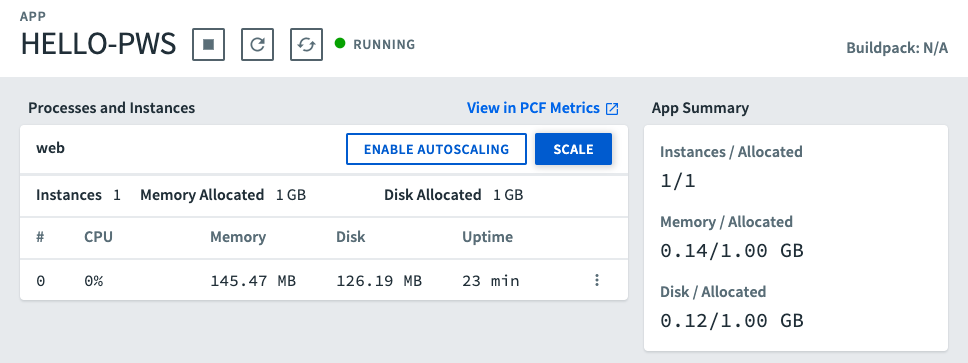
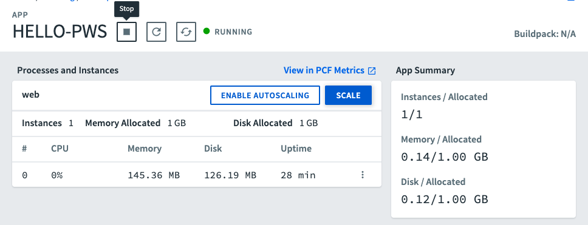

# Hello PWS Tutorial

The purpose of this tutorial is to have you deploy a simple web service to PWS.

This assumes that you have successfully created a PWS account and have installed the PWS CLI tools. If that is not the case, complete the steps found at https://docs.run.pivotal.io/starting/index.html before completing this tutorial.

You will need:

* Internet connection
* Browser
* Terminal/command prompt
* PWS account
* Locally installed PWS CLI tools
* Spring Initializr (start.sping.io)
* IntelliJ IDEA Community Edition
* Java 8 (or greater) JDK

## Building the System

We'll build the system in the following steps:

1. Create Hello PWS web service locally
2. Create controller
3. Run Hello PWS locally
4. Build and package Hello PWS service
5. Push Hello PWS to PWS
6. View the Service in PWS Apps Manager
7. Shut Down Service

### Step 1: Create the Project

Step 1 is to create the application.  We'll use the Spring Initializr to create our project. Go to ```start.spring.io``` and enter the following information:

- Group = com.trilogyed
- Artifact = hello-pws
- Dependencies = Spring Web Starter

Download the project, copy it into your working directory, and open the project in IntelliJ.

### Step 2: Create Controller

Now we will create a controller that contains a simple "hello" endpoint. Create a new Java class called ```com.trilogyed.hellopws.controller.HelloController``` and add the following code:

```java
@RestController
public class HelloController {

    @RequestMapping(value = "/hello", method = RequestMethod.GET)
    public String hello() {
        return "Hello, PWS!!!";
    }
}
```

### Step 3: Run Hello PWS Locally

Next, run Hello PWS with IntelliJ. Open a browser and visit ```http://localhost:8080/hello``` to make sure your web service is working properly. You should see ```Hello, PWS!!!``` in your browser.

### Step 4: Build and Package Hello PWS Service

We must build and package our service before we push it to PWS. We'll use Maven to do this. Open the Maven window in IntelliJ by clicking on the Maven tab toward the top of the right side of your IDE. It should display the following:


Now expand the **Lifecycle** menu item and then double-click on the **package** item. This will build the project and package it into an executable JAR file. This JAR file contains the appliication *and* the Tomcat servlet container in which our application will run. The JAR file will be placed in the ```target``` directory of your project.

 

### Step 5: Push Hello PWS to PWS

Now we'll deploy our service to PWS. Open a terminal or command prompt window and navigate to the ```target``` directory of your Hello PWS project. That directory should contain a file called ```hello-pws-0.0.1-SNAPSHOT.jar```.

##### 5.1 Login to PWS

We have to login to PWS before we can push our service. Type the following command into your terminal or command prompt and then supply your username and password when asked:

```cf login -a api.run.pivotal.io```

This will log you into the Org and Space of your PWS account.

##### 5.2 Push Service to PWS

We use the ```cf push``` to deploy our applications.  This command requires an application name and the path to our application JAR file. The push process creates a URL for our application, we will use the 

```--random-route``` flag to ensure that our URL is unique.

Type the following command into your terminal or command prompt:

```cf push HELLO-PWS --random-route -p hello-pws-0.0.1-SNAPSHOT.jar```

This will kick off the deployment process. You should see something similar to this in your terminal or command prompt after successful deployment:


##### 5.3 Visit ```hello``` Endpoint

Finally, we can visit the ```hello``` endpoint on the application we just deployed to PWS. Open a browser and type in the ```route``` value displayed plus ```/hello```. In our example it is:

```http://hello-pws-balanced-rabbit.cfapps.io/hello```

You should see ```Hello, PWS!!!```.

### Step 6: View the Service in PWS Apps Manager

We can view the details of deployed services in the web-based PWS Apps Manager. Open a browser, navigate to ```https://console.run.pivotal.io/```, and login when prompted. This will display your Apps Manager homepage. Click into your Org and then click into your Space. This will display a list of your deployed applications. ```HELLO-PWS``` should appear in this list. Click on ```HELLO-PWS``` to display the application details:




#### **Congratulations! You just deployed your first PWS application!**


### Step 7: IMPORTANT!! Shut Down Service

Finally, we have to shut down our service. Running services cost money and there is no reason to keep this service running and having it draw down the $87 in PWS credits.

Click the **Stop** button as shown in the image below:

