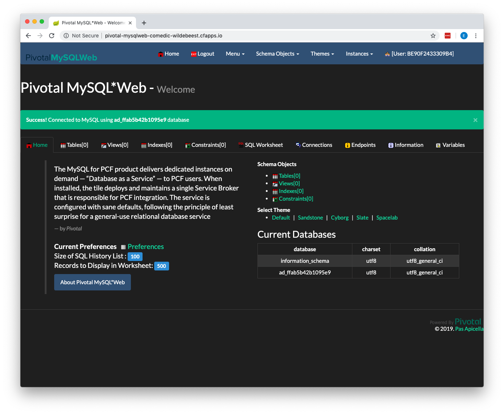

# Pivotal MySQL Web Installation

The purpose of this document is to have you deploy Pivotal MySQL Web database management tool to PWS. You can use Pivotal MySQL Web to manage MySQL schemas running on PWS much like you use MySQL Workbench to manage MySQL schemas running locally.

You will need:

- Internet connection
- Browser
- Terminal/command prompt
- PWS account
- Locally installed PWS CLI tools

## Installing Pivotal MySQL Web

We'll install the application in the following steps:

1. Create a MySQL service in PWS
2. Clone the Pivotal MySQL Web project from GitHub
3. Build and package the Pivotal MySQL Web project
4. Create the ```manifest.yml``` file
5. Deploy Pivotal MySQL Web to PWS
6. Access Pivotal MySQL Web

### Step 1: Create MySQL Service in PWS

The first step is to create a MySQL service instance in our PWS account. This service will be used by the apps in your Space and will be the service we manage with Pivotal MySQL Web.

##### 1.1 Login to PWS

Log into your PWS Apps Manager at ```https://console.run.pivotal.io```. You should see something similar to the following:


##### 1.2 Display Your Org Page

Click on the link to your Org to display the Org page:


##### 1.3 Display Your Development Space Page

Click on the link to your development Space:


##### 1.4 Click the Services Menu

Click on the **Services** menu item in the left hand menu:


##### 1.5 Click Add A Service

Click the **ADD A SERVICE** button:


##### 1.6 Select ClearDB MySQL Server

Click on the ClearDB MySQL Server menu item:


##### 1.7 Select Plan

Select the **Spark DB free** plan and click the **SELECT PLAN** button:


##### 1.8 Configure Instance

Enter **MYSQL-SERVICE** as the Instance Name and click the **CREATE** button:


### Step 2: Clone Pivotal MySQL Web Project

Now we will clone the GitHub repo that contains the Pivotal MySQL Web project. Navigate to ```https://github.com/pivotal-cf/PivotalMySQLWeb``` and clone the repo to your laptop.

### Step 3: Build and Package Project

Open a terminal or command prompt and navigate to the ```PivotaMySQLWeb``` directory that you cloned in the previous step. Build and package the project by typing the following command:

```./mvnw -DskipTests=true package```

```-DskipTests=true``` tells Maven to skip the unit tests when building this project. Unit tests for this project require a Docker install, which we do not have.

### Step 4: Create Manifest File

The ```manifest.yml``` file tells the ```cf push``` command how to deploy the application. Create a new file called ```manifest.yml``` in the ```PivotalMySQLWeb``` directory. Add the following content to the file:

```yaml
applications:
- name: pivotal-mysqlweb
  memory: 1024M
  instances: 1
  random-route: true
  path: ./target/PivotalMySQLWeb-1.0.0-SNAPSHOT.jar
  services:
    - MYSQL-SERVICE
  env:
    JAVA_OPTS: -Djava.security.egd=file:///dev/urandom
```

We'll use this file when we deploy the application in the next step.

### Step 5: Deploy Pivotal MySQL Web

Now we will deploy Pivotal MySQL Web to our PWS account. Open a terminal or command prompt and navigate to the PivotalMySQLWeb directory.

Login to your PWS account by issuing the following command:

```cf login -a api.run.pivotal.io```

Once logged in, issue the following command to push the application to your account:

```cf push -f manifest.yml```

Something similar to the following will be displayed in your terminal or command prompt if the deploy was successful:


### Step 6: Access Pivotal MySQL Web

Open a browser and navigate to the route/url assigned to your application when deployed. The route is ```pivotal-mysqlweb-comedic-wildebeest.cfapps.io``` in this example.

Use the following username/password:

Username: admin

Password: cfmysqlweb

You should see the following:



### IMPORTANT!!! Stop the ```pivotal-mysqlweb``` App in your App Manager

Now log into PWS Apps Manager and shut down Pivotal MySQL Web so it does not use any more of your PWS credits.