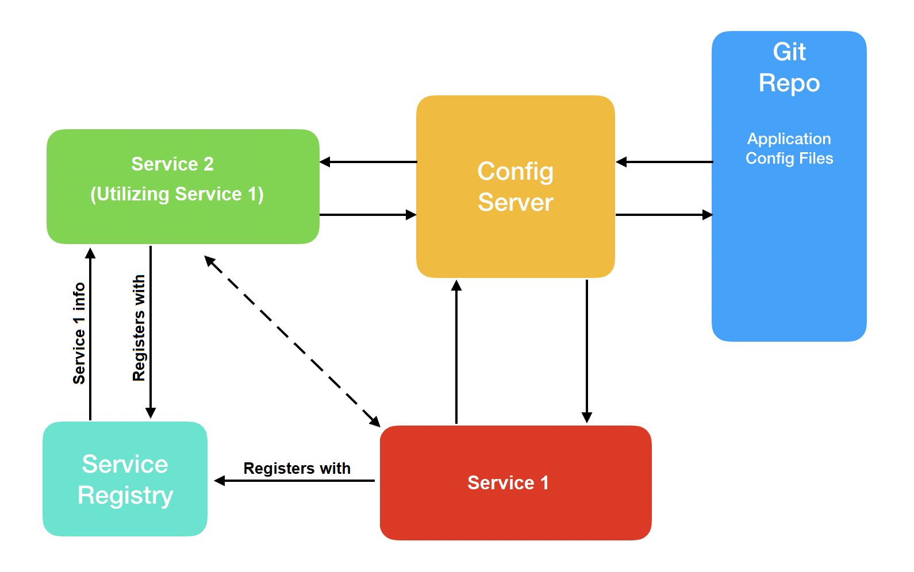

# Edge Service / Feign Tutorial

This tutorial steps you through using the Feign web service client and the Eureka service registry to communicate with other services in the system.

You will need:

- A completed and working version of the ```service-registry-tutorial``` system
- Spring Initializr (start.spring.io)
- IntelliJ Community Edition

## System Design




**Important:** This system builds on the ```service-registry-tutorial``` and assumes that you have successfully completed it. Make sure you complete that tutorial before beginning this one.

## Modify the System

We will modify the ```service-registry-tutorial``` by swapping out the RestTemplate for the Feign web service client.

All of the changes for this tutorial will be made to the ```hello-cloud-service``` from the ```service-registry-tutorial```. We'll build the system in the following steps:

1. Add dependencies to the POM file.
2. Enable Feign.
3. Create the Feign client.
4. Modify the Controller to use the Feign client.

### Step 1: Add Dependencies

Before you begin, open the ```hello-cloud-service``` project in IntelliJ.

The first step is to add the Feign libraries to the project. To do so, open the POM file and add the following dependency:

```xml
		<dependency>
			<groupId>org.springframework.cloud</groupId>
			<artifactId>spring-cloud-starter-feign</artifactId>
			<version>1.4.7.RELEASE</version>
		</dependency>
```

### Step 2: Enable Feign

The next step is to enable Feign. To do so, we will add the ```@EnableFeignClients``` annotation to the```com.trilogyed.hellocloudservice.HelloCloudService.java``` class. 

Open ```com.trilogyed.hellocloudservice.HelloCloudService.java``` and modify it so it looks like this:

```java
@SpringBootApplication
@EnableDiscoveryClient
@EnableFeignClients
public class HelloCloudServiceApplication {

	public static void main(String[] args) {
		SpringApplication.run(HelloCloudServiceApplication.class, args);
	}
}
```

### Step 3: Create the Feign Client

The Feign library allows us to create web service clients in a declarative manner using annotations and an interface definition. No code is required beyond the annotated interface definition. We will use the following two annotations:

* @FeignClient
* @RequestMapping

#### @FeignClient

This interface-level annotation marks our interface as a Feign client. The ```name``` parameter allows us to specify the web service that our client interacts with.

#### @RequestMapping

This is the same annotation we use to define endpoints in our web service Controllers. In this case, we use it to define which of the service endpoints a given method definition should interact with.

Create a new Java interface called ```com.trilogyed.hellocloudservice.util.feign.RandomGreetingClient.java``` and add the following code:

```java
@FeignClient(name = "random-greeting-service")
public interface RandomGreetingClient {

    @RequestMapping(value = "/greeting", method = RequestMethod.GET)
    public String getRandomGreeting();
}
```

Items to note about this code:

1. The ```@FeignClient``` marks this interface as a Feign client. The ```name``` attribute is the name of the service this client will interact with. This name must match the name of a service registered with Eureka.
2. The ```@RequestMapping``` annotation allows us to specify which endpoint should be called when the annotated method is invoked. In our case, a GET request will be issued to ```/greeting``` on the ```random-greeting-service``` whenever ```getRandomGreeting``` is invoked in our code.

### Step 4: Modify the Controller

Finally, we will modify the Controller to use the Feign client instead of the ```RestTemplate``` for interaction with the ```random-greeting-service```. 

Open ```com.trilogyed.hellocloudservice.controller.HelloCloudServiceController.java``` and modify it so it looks like the code below. The original ```RestTemplate```-based code as been commented out so we can see each version side by side. It is clear that the Feign-based code is much less complex.

```java
@RestController
@RefreshScope
public class HelloCloudServiceController {

//    @Autowired
//    private DiscoveryClient discoveryClient;
//
//    private RestTemplate restTemplate = new RestTemplate();
//
//    @Value("${randomGreetingServiceName}")
//    private String randomGreetingServiceName;
//
//    @Value("${serviceProtocol}")
//    private String serviceProtocol;
//
//    @Value("${servicePath}")
//    private String servicePath;
//
//    @Value("${officialGreeting}")
//    private String officialGreeting;

    @Autowired
    private final RandomGreetingClient client;


    HelloCloudServiceController(RandomGreetingClient client) {
        this.client = client;
    }

    @RequestMapping(value="/hello", method = RequestMethod.GET)
    public String helloCloud() {

//        List<ServiceInstance> instances = discoveryClient.getInstances(randomGreetingServiceName);
//
//        String randomGreetingServiceUri = serviceProtocol + instances.get(0).getHost() + ":" + instances.get(0).getPort() + servicePath;
//
//        String greeting = restTemplate.getForObject(randomGreetingServiceUri, String.class);
//
//        return greeting;

        return client.getRandomGreeting();
    }
}
```

Items to note about this code:

1. No additional annotations are needed on the Controller.
2. We use DI constructor injection to wire the ```RandomGreetingClient``` into the Controller.
3. The Feign client makes the web service call to the ```random-greeting-service``` look like a normal method call.

## Run the System

Start the services in the following order:

1. ```cloud-config-service```
2. ```eureka-service-registry```
3. ```random-greeting-service```
4. ```hello-cloud-service```

Open a browser and visit http://localhost:7979. You should see one of the random greetings from the Random Greeting Service. Refresh the page and you should get different greetings.

---

© 2019 Trilogy Education Services